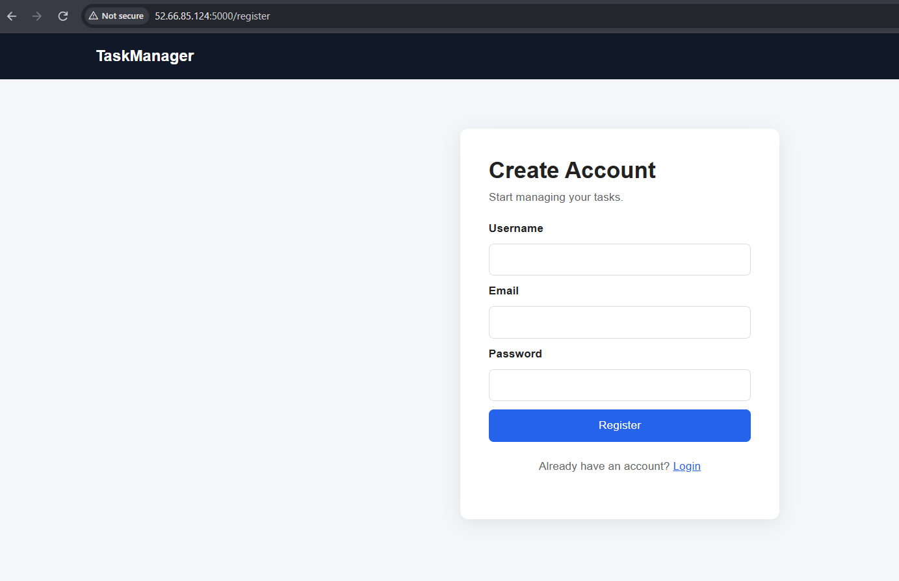
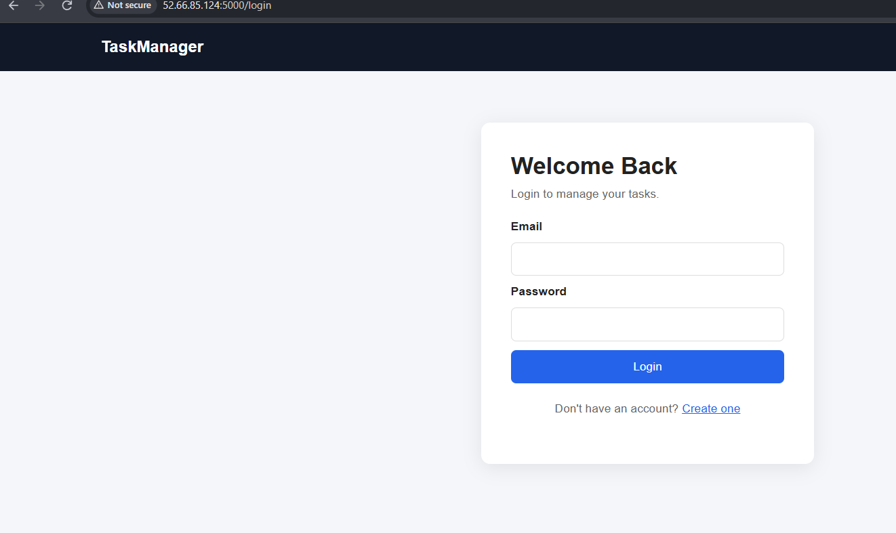
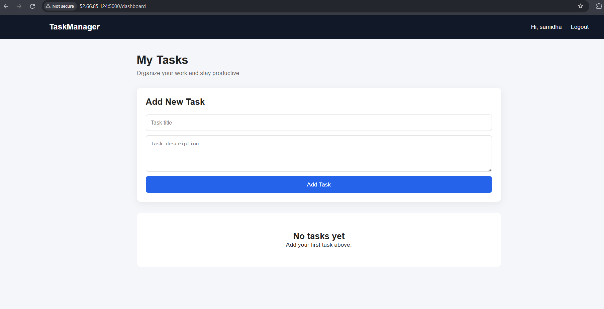
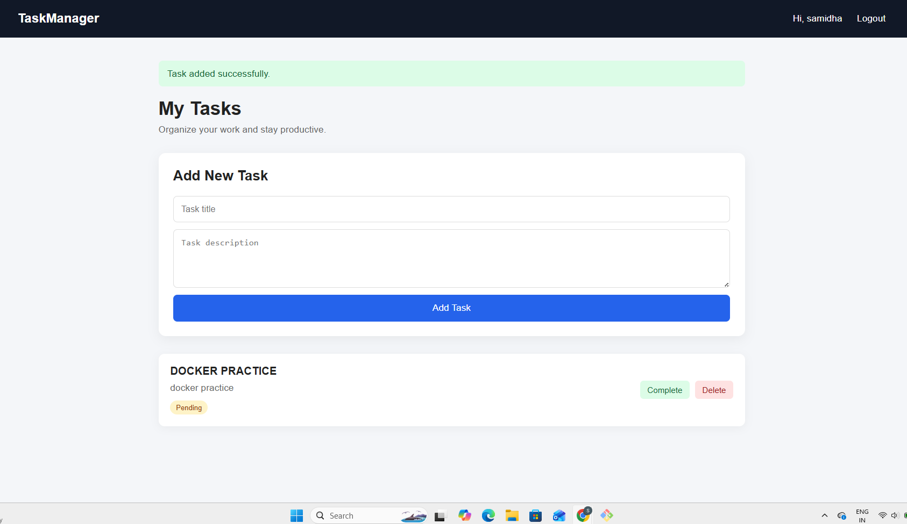

# Task Manager Application

A full-stack Task Manager application built using **Python Flask, MySQL, Docker, Docker Compose, Jenkins CI/CD, and AWS EC2**.

This project demonstrates application development, database integration, containerization, persistent storage, automated Docker image builds, and continuous deployment.

---

## 🚀 Features

- User registration and login
- Secure password hashing
- Session-based authentication
- Create tasks
- View tasks
- Mark tasks as completed
- Delete tasks
- User-specific task management
- MySQL database integration
- Docker containerization
- Docker Compose multi-container setup
- Persistent MySQL storage
- Jenkins CI/CD automation
- Automated Docker image builds
- AWS EC2 deployment

---

# Screenshots

## Registration Page 




## Login Page 




## Dashboard Page 




## Task Added Page 



---

## 🛠️ Tech Stack

| Category | Technology |
|---|---|
| Backend | Python, Flask |
| Frontend | HTML, CSS |
| Database | MySQL 8 |
| Containerization | Docker |
| Container Orchestration | Docker Compose |
| CI/CD | Jenkins |
| Version Control | Git, GitHub |
| Cloud | AWS EC2 |
| Operating System | Ubuntu Linux |

---

## 🏗️ Architecture

```text
                         ┌───────────────┐
                         │    GitHub     │
                         │   Repository  │
                         └───────┬───────┘
                                 │
                              Webhook
                                 │
                                 ▼
                         ┌───────────────┐
                         │    Jenkins    │
                         │    CI/CD      │
                         └───────┬───────┘
                                 │
                           Docker Build
                                 │
                                 ▼
                    ┌─────────────────────────┐
                    │        AWS EC2          │
                    │                         │
                    │   ┌─────────────────┐   │
                    │   │ Flask App       │   │
                    │   │ Container       │   │
                    │   │ Port 5000       │   │
                    │   └────────┬────────┘   │
                    │            │            │
                    │      Docker Network     │
                    │            │            │
                    │            ▼            │
                    │   ┌─────────────────┐   │
                    │   │ MySQL 8         │   │
                    │   │ Container       │   │
                    │   │ task_manager    │   │
                    │   └────────┬────────┘   │
                    │            │            │
                    │            ▼            │
                    │       mysql_data        │
                    │    Persistent Volume    │
                    └─────────────────────────┘
